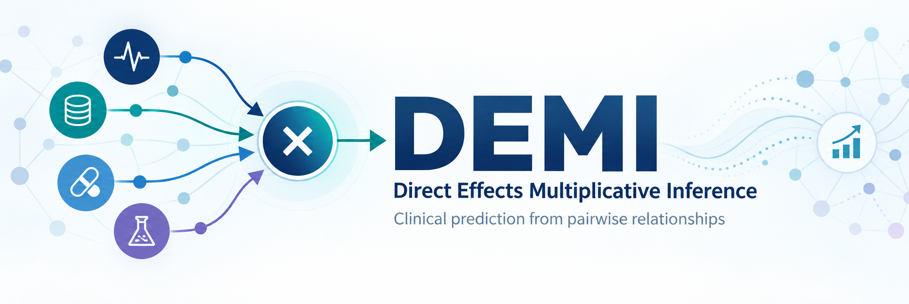
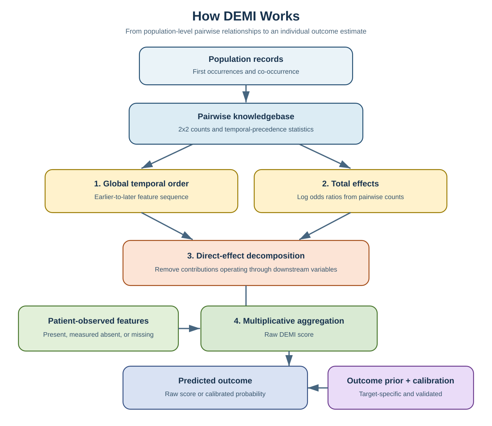

# Welcome to DEMI 👋

## What is DEMI?

**Direct Effects Multiplicative Inference (DEMI)** is a research framework for
prediction using population-level relationships. It identifies direct effects
and combines them to generate an individual score or probability.

DEMI includes a **small-data branch** and a **large-data branch**, allowing the
method to adapt to outcomes with different amounts of available data.

- [DEMI Ecosystem](#demi-ecosystem): Core algorithm, database resources, and tutorials
- [Projects Using DEMI](#projects-using-demi): Research applications across clinical areas
- [Publications](#publications): Papers, citations, and reproducibility resources

<strong>View the conceptual DEMI workflow</strong>

 

 

### [DEMI Core](https://github.com/Direct-Effects-Multiplicative-Inference/demi)

[GitHub](https://github.com/Direct-Effects-Multiplicative-Inference/demi) |
[API Documentation](https://github.com/Direct-Effects-Multiplicative-Inference/demi/blob/main/docs/API.md) |
[Tutorials](https://github.com/Direct-Effects-Multiplicative-Inference/demi-tutorials)

▶ Learn more

 

The current reusable DEMI algorithm and database-neutral Python API.

DEMI is research software and is not intended to be the sole basis for clinical
diagnosis or treatment. Independent validation is required before use in a new
population or health system. Calibrated probabilities require validated,
outcome-specific calibration data.

The algorithm is associated with pending U.S. Patent Application No.
19/253,342. Public software licensing terms are under institutional review.

### [DEMI Database](https://github.com/Direct-Effects-Multiplicative-Inference/demi-database)

[GitHub](https://github.com/Direct-Effects-Multiplicative-Inference/demi-database) |
[Database Contract](https://github.com/Direct-Effects-Multiplicative-Inference/demi-database/blob/main/docs/DATABASE_SCHEMA.md) |
[Temporal Order](https://github.com/Direct-Effects-Multiplicative-Inference/demi-database/blob/main/docs/TEMPORAL_ORDER.md)

▶ Learn more

 

Database contracts, release documentation, provenance requirements, and
authorized-access guidance.

The organization does not publish patient-level data, participant identifiers,
credentials, controlled research extracts, or automatically redistribute the
original production database. DEMI may be used with an authorized compatible
database or with the original production DEMI database when its owner grants
access. Database access and software access are governed separately.

### [DEMI Tutorials](https://github.com/Direct-Effects-Multiplicative-Inference/demi-tutorials)

[GitHub](https://github.com/Direct-Effects-Multiplicative-Inference/demi-tutorials) |
[Getting Started](https://github.com/Direct-Effects-Multiplicative-Inference/demi-tutorials#planned-tutorials)

▶ Learn more

 

Step-by-step notebooks and examples for using DEMI with an authorized existing
database. Tutorials will expand as the interface and research applications
develop.

 

### Antidepressant Response Prediction

[Better Antidepressants for You – Home](https://rapidimprovement.ai/) |
[DEMI Service](https://github.com/Direct-Effects-Multiplicative-Inference/demi-service)

▶ Learn more

 

Research on outcome prediction and AI-assisted treatment-selection support
using longitudinal clinical data. DEMI Service integrates the DEMI algorithm
into the research application through database access, concept resolution,
pairwise retrieval, calibration lookup, and application-compatible responses.

This application-integration work was funded by the Patient-Centered Outcomes
Research Institute (PCORI), Award ME-2024C1-36732. Associated analyses have
used de-identified data from the National Institutes of Health All of Us
Research Program under its approved data-use framework.

The views presented are those of the authors and do not necessarily represent
the views of PCORI, its Board of Governors, or its Methodology Committee.

### [DEMI Mental Health Screening](https://github.com/Direct-Effects-Multiplicative-Inference/demi-mental-health-screening)

[GitHub](https://github.com/Direct-Effects-Multiplicative-Inference/demi-mental-health-screening)

▶ Learn more

 

Research and external validation of DEMI-based screening and prediction models
for mental-health conditions.

### [DEMI Rare Cancer Screening](https://github.com/Direct-Effects-Multiplicative-Inference/demi-rare-cancer-screening)

[GitHub](https://github.com/Direct-Effects-Multiplicative-Inference/demi-rare-cancer-screening)

▶ Learn more

 

Research on prediction and screening across rare cancers, including external
validation with independent clinical data sources.

### [DEMI Common Cancer Screening](https://github.com/Direct-Effects-Multiplicative-Inference/demi-common-cancer-screening)

[GitHub](https://github.com/Direct-Effects-Multiplicative-Inference/demi-common-cancer-screening)

▶ Learn more

 

Research evaluating DEMI-based prediction and screening methods for more
prevalent cancers, including cross-database validation.

### [DEMI Research Contributions](https://github.com/Direct-Effects-Multiplicative-Inference/demi-research-contributions)

[GitHub](https://github.com/Direct-Effects-Multiplicative-Inference/demi-research-contributions)

▶ Learn more

 

An incubator for additional analyses, research prototypes, and community
contributions. Mature projects may later move into their own repositories.

Project names describe research areas and do not imply that a model is
approved for clinical screening.

 

[Publication Index](https://github.com/Direct-Effects-Multiplicative-Inference/demi-publications) |
[Citation Information](https://github.com/Direct-Effects-Multiplicative-Inference/demi-publications#publication-index)

▶ Learn more

 

The publications repository provides manuscript status, citations, links to
papers, and paper-specific reproducibility materials. Because DEMI continues
to develop, each publication should identify and cite the exact tagged
software release used in its analyses.

